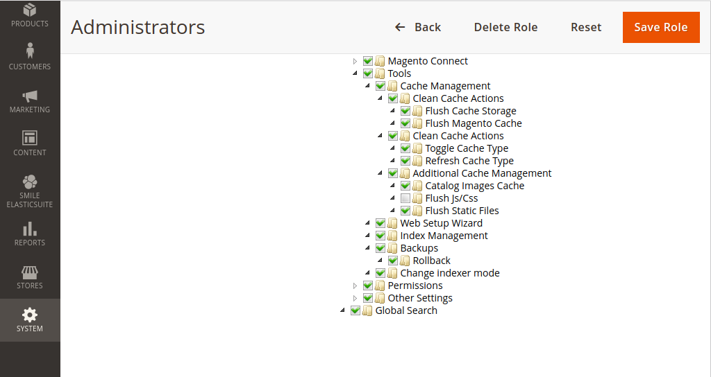

# Advanced Acl Permissions module for Magento 2

## Overview
The Magento standard ACL defines access to 'Cache Management' the problem is that if this is enabled then the user has access to all cache flushing features. The module allow more granular ACL configuration for a better cache management.

## Installation details
 
Simply require module in your project using composer.
* `composer require ctidigital/module-advanced-acl-permissions`
* `php bin/magento module:enable CtiDigital_AdvancedAclPermissions`
* `php bin/magento setup:upgrade`
 
## Features

### Configuration 
Configuration is available in admin panel for a given customer role System > All Users

* **Configuration**
    * **Enabled** - enable/disable newsletter on checkout
    * **Subscribe checkout label** - newsletter label visible on checkout
   
### Overrides
* Preference for Magento\Backend\Block\Cache

